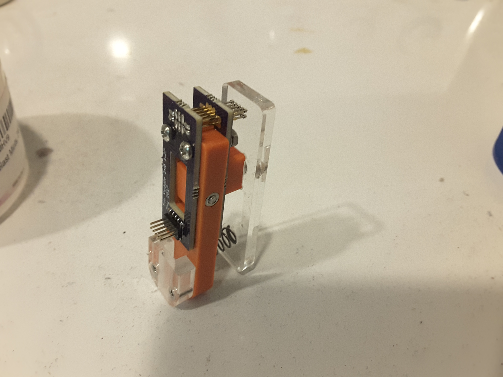

This is a pcb to match these Chinese test clips from [Taobao](https://item.taobao.com/item.htm?spm=a1z09.2.0.0.38b5fcacO9Mc7q&id=42343856957&_u=q1sfp74rc058).

You need two pcbs one for the top, one for the bottom.

The correct pogo pins for 1.27mm are hard to find, buy the thinest you can.

